# 🏘️ 村务公开系统

轻量级村级数字化管理平台，Go + SQLite 单机部署，零框架依赖。通过环境变量 `VILLAGE_NAME` 切换村名，开箱即用。

## 截图预览

| 村民端 | 管理后台 |
|--------|----------|
| 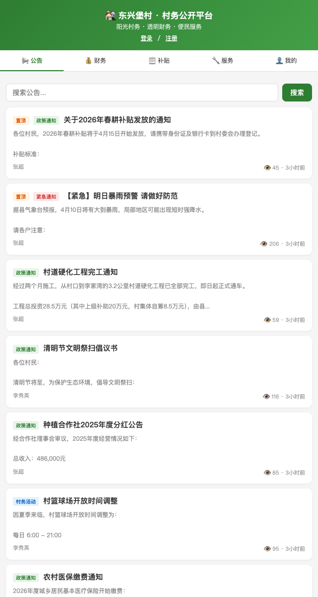 | 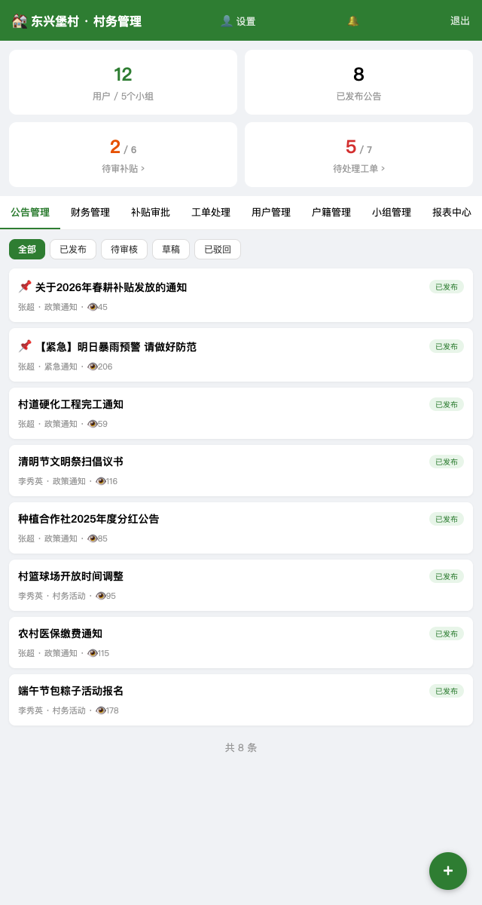 |
| 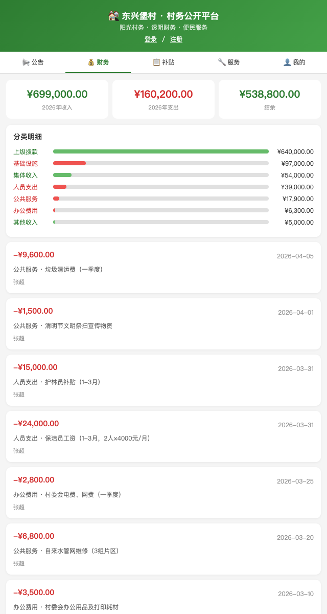 | 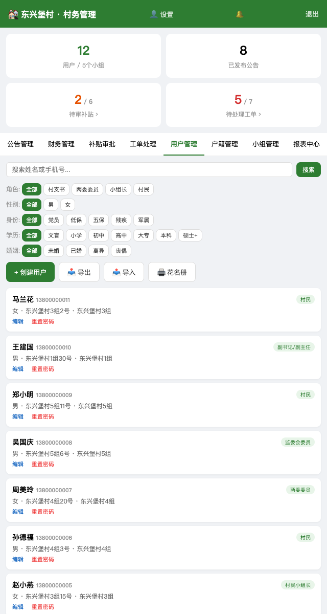 |
| 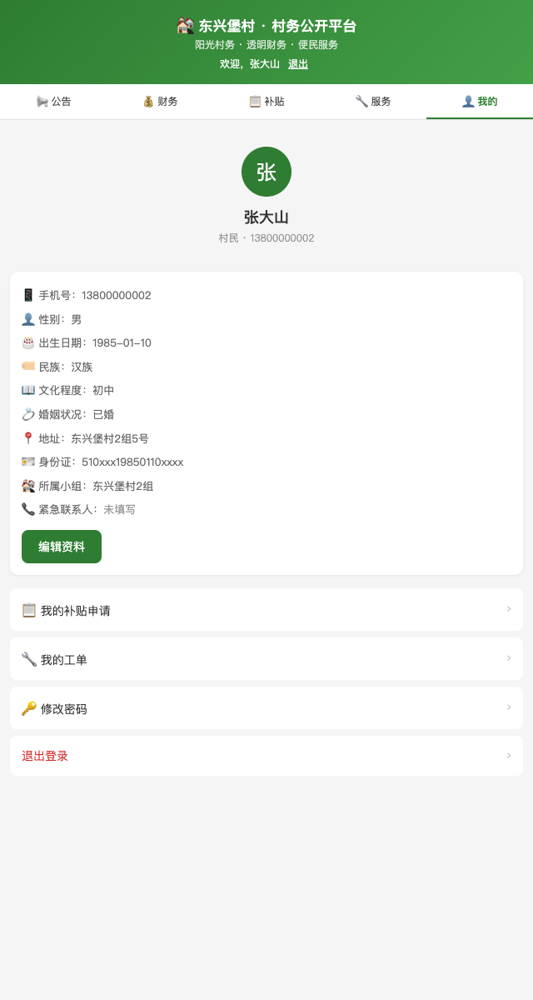 | 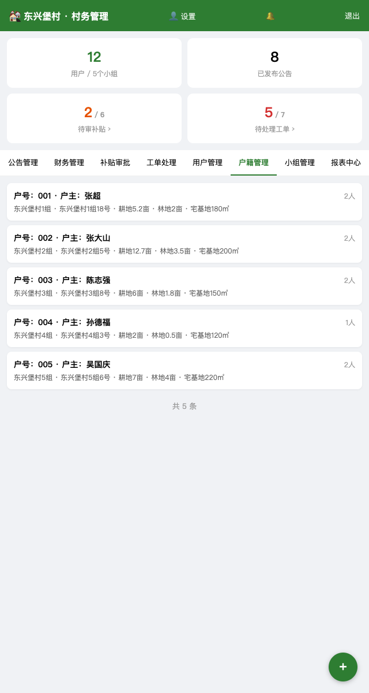 |

<details>
<summary>更多截图</summary>

| | |
|---|---|
| 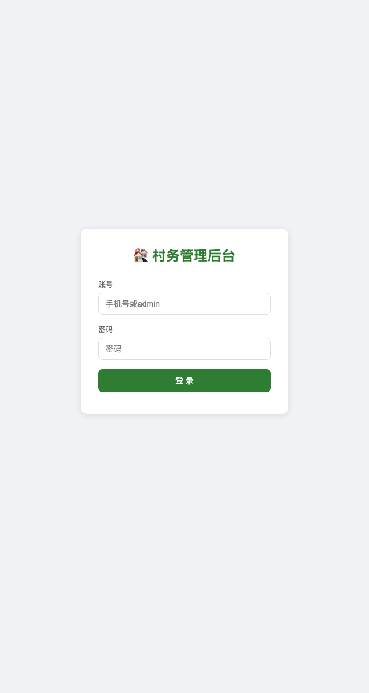 |  |
| 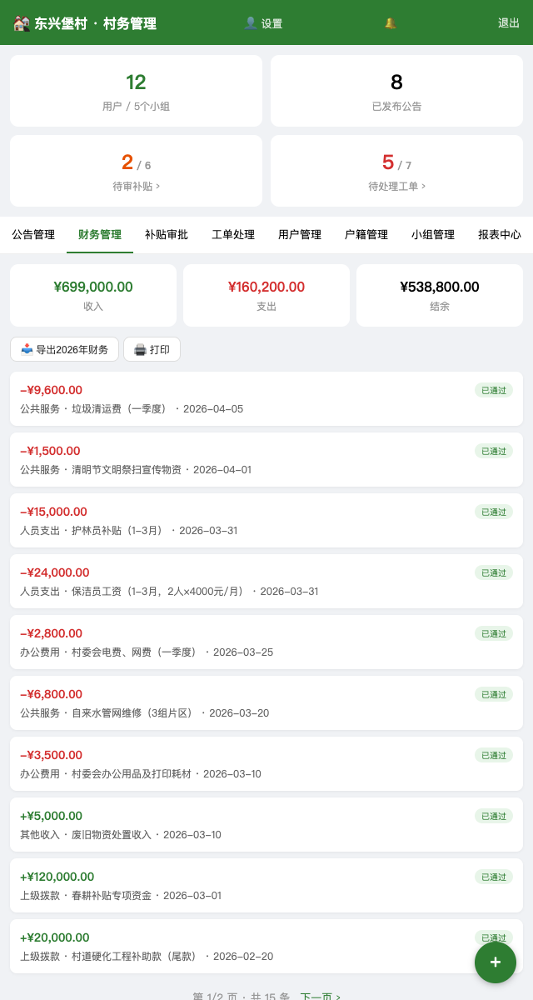 | 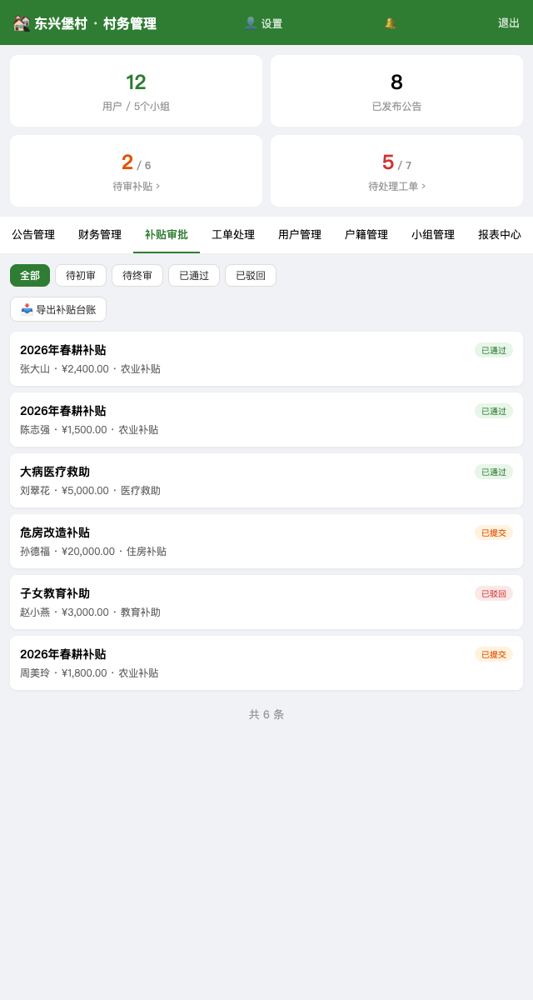 |
| 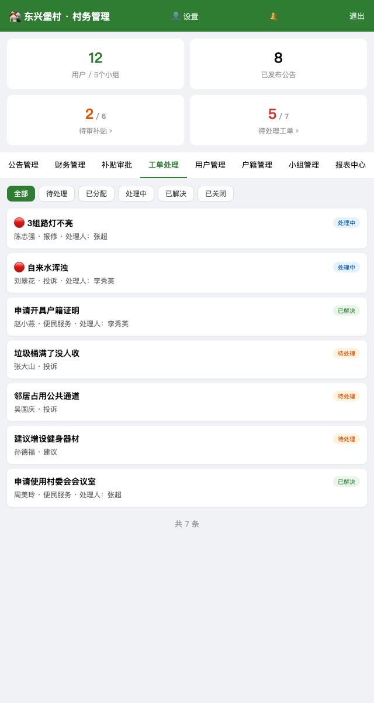 | 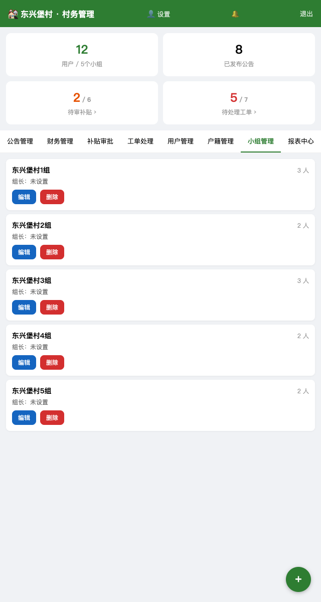 |
| 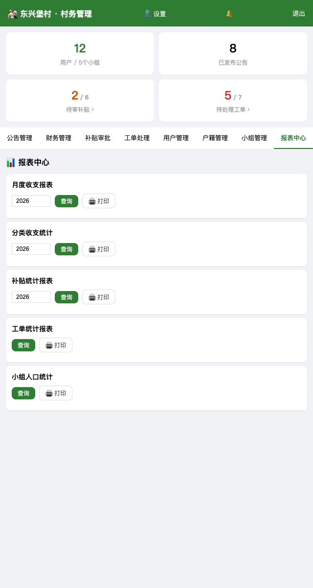 | 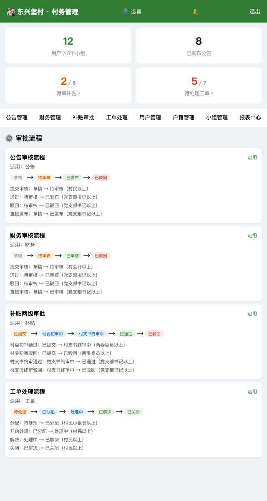 |

</details>

## 功能模块

| 模块 | 说明 |
|------|------|
| 📢 村务公告 | 发布/置顶/分类/富文本编辑/浏览量统计/审核流程 |
| 💰 财务公示 | 收支记录/凭证上传/分类统计/年度汇总/审核流程/打印 |
| 📋 补贴审批 | 村民申请 → 村委初审 → 村支书终审（两级审批）/打印审批单 |
| 🔧 村民工单 | 报修/投诉/建议/便民服务/图片上传/分配/回复跟踪 |
| 👥 用户管理 | 注册/登录/多角色/多维度筛选/特殊身份标记/花名册打印 |
| 🏠 户籍管理 | 户号/户主/成员关系(17种)/耕地/林地/宅基地/一户一主校验 |
| 👨‍👩‍👧‍👦 小组管理 | 村民小组/组长分配/人数统计 |
| ⚙️ 审批流程 | 可配置状态机/转换规则/角色权限/自动通知 |
| 📊 报表中心 | 月度收支/分类统计/补贴统计/工单统计/人口统计/打印 |
| 📤 数据导入 | Excel模板下载/批量导入村民(含民族/学历/婚姻等) |
| 📥 数据导出 | 用户/财务/补贴台账Excel导出 |
| 🔔 消息通知 | 站内通知/未读计数/微信订阅消息推送 |
| 📱 微信小程序 | 微信一键登录/公告/补贴/工单/个人中心 |
| 🔒 权限体系 | 11级角色/行级数据权限/小组长数据隔离/驻村干部只读监督 |

## 角色体系

参照中国农村"村两委"体制，系统内置 11 级角色：

| 角色 | 等级 | 说明 |
|------|------|------|
| admin | 99 | 系统管理员 |
| secretary | 90 | 党支部书记（一把手） |
| resident_official | 88 | 驻村第一书记/驻村干部（上级派驻，只读监督） |
| director | 85 | 村委会主任 |
| deputy | 70 | 副书记/副主任 |
| supervisor | 65 | 村务监督委员会 |
| committee | 60 | 两委委员 |
| accountant | 50 | 村会计/出纳 |
| group_leader | 40 | 村民小组长 |
| grid_worker | 35 | 网格员（信息采集、矛盾排查，全村只读） |
| villager | 10 | 普通村民 |

- 用户可拥有多角色（逗号分隔）
- 管理后台最低权限：网格员（grid_worker）
- 小组长通过行级权限只能查看本组用户
- 网格员可查看全村数据，但为只读权限，不参与审批
- 驻村干部可查看全部数据，但为只读权限，不参与审批操作
- 财务审核需监委会以上权限，且不能审核自己录入的记录
- 公告审核、财务删除需副书记/副主任以上权限
- 党员身份通过 `is_party_member` 字段标记，不作为角色

## 用户信息字段

参照中国户口簿和农村人口管理规范：

| 分类 | 字段 |
|------|------|
| 基本信息 | 姓名、性别、出生日期、民族、身份证号 |
| 社会信息 | 文化程度、婚姻状况、地址 |
| 特殊身份 | 党员、低保户、五保户、残疾人、军属/退役 |
| 联系方式 | 手机号、微信号、紧急联系人/电话 |
| 组织关系 | 所属小组、所属户籍、角色、职务 |

## 户籍管理

按中国农村土地承包制度，土地信息挂在户上：

| 字段 | 说明 |
|------|------|
| 户号 | 户口簿编号 |
| 户主 | 搜索选择 |
| 成员关系 | 户主/配偶/之子/之女/之父/之母/儿媳/女婿/之孙/之孙女/祖父/祖母/外祖父/外祖母/兄弟/姐妹/其他 |
| 承包耕地 | 亩 |
| 林地面积 | 亩 |
| 宅基地面积 | 平方米 |

- 一个用户只能属于一个户籍
- 一个户籍只能有一个户主
- 编辑用户时可直接选择户籍，自动同步成员关系

## 快速启动

```bash
# 编译
go build -o server ./cmd/server

# 初始化演示数据（可选）
VILLAGE_NAME=幸福村 go run ./cmd/seed

# 启动
VILLAGE_NAME=幸福村 ./server

# Docker 部署
VILLAGE_NAME=幸福村 docker compose up -d
```

## 环境变量

| 变量 | 说明 | 默认值 |
|------|------|--------|
| VILLAGE_NAME | 村名，全局显示 | 东兴堡村 |
| JWT_SECRET | JWT 签名密钥 | 随机生成（重启失效） |
| WX_APPID | 微信小程序 AppID | 空（测试模式） |
| WX_APPSECRET | 微信小程序 AppSecret | 空 |
| WX_TPL_NOTIFY | 微信订阅消息模板ID | 空（不推送） |
| CORS_ORIGIN | 允许的跨域来源域名 | 空（跟随请求 Origin） |

### 微信小程序配置

> ⚠️ **强烈建议使用企业/组织主体注册小程序**（村委会、乡镇政府、企业营业执照均可）。个人主体小程序无法使用微信手机号快捷登录、订阅消息推送等核心能力，且「政务/生活服务」类目不对个人开放。

#### 1. 注册小程序

- 前往 [微信公众平台](https://mp.weixin.qq.com/) → 「立即注册」→ 选择「小程序」
- 主体类型选择「企业」或「政府/事业单位」（村委会属于此类）
- 完成认证后，在「开发管理」→「开发设置」中获取 **AppID** 和 **AppSecret**

#### 2. 配置服务器

- 设置环境变量：
  ```bash
  export WX_APPID=你的AppID
  export WX_APPSECRET=你的AppSecret
  ```
- 在小程序后台「开发管理」→「开发设置」→「服务器域名」中添加：
  - request 合法域名：`https://your-domain.com`（必须 HTTPS）

#### 3. 导入小程序代码

- 下载 [微信开发者工具](https://developers.weixin.qq.com/miniprogram/dev/devtools/download.html)
- 导入项目 `miniapp/` 目录，填入你的 AppID
- 修改 `miniapp/utils/api.js` 中的 `BASE` 为你的服务器地址：
  ```javascript
  var BASE = 'https://your-domain.com'
  ```
- 点击「预览」扫码测试，确认无误后「上传」→ 在公众平台提交审核

#### 4. 消息推送（可选）

- 在小程序后台「订阅消息」中创建模板，字段要求：
  - `thing1`：通知标题（≤20字）
  - `thing2`：通知内容（≤20字）
- 将模板 ID 设置到环境变量 `WX_TPL_NOTIFY`

#### 个人主体 vs 企业主体对比

| 能力 | 个人主体 | 企业/组织主体 |
|------|----------|---------------|
| 微信手机号快捷登录 | ❌ | ✅ |
| 订阅消息推送 | 受限 | ✅ |
| 政务/生活服务类目 | ❌ | ✅ |
| 微信支付 | ❌ | ✅ |
| 小程序备案 | 可备案 | 可备案 |

个人主体也能运行本系统，但用户需手动输入手机号绑定，无法使用一键获取手机号功能。

启动后：
- 村民端: http://localhost:8080/app/
- 管理端: http://localhost:8080/admin/

## 默认账号

| 角色 | 账号 | 密码 |
|------|------|------|
| 管理员（村支书） | admin | 123456 |
| 村民 | 13800000002 | 123456 |

## 项目结构

```
village-system/
├── cmd/
│   ├── server/main.go        # 服务入口，路由注册
│   └── seed/main.go          # 演示数据生成
├── internal/
│   ├── model/
│   │   ├── model.go           # 数据模型
│   │   └── workflow_def.go    # 工作流/报表模型
│   ├── store/
│   │   ├── db.go              # 数据库初始化/Schema/种子数据
│   │   ├── user.go            # 用户 CRUD
│   │   ├── notice.go          # 公告 CRUD
│   │   ├── finance.go         # 财务 CRUD
│   │   ├── subsidy.go         # 补贴 CRUD
│   │   ├── ticket.go          # 工单 CRUD
│   │   ├── group.go           # 小组 CRUD
│   │   ├── household.go       # 户籍 CRUD
│   │   ├── workflow.go        # 工作流日志
│   │   ├── workflow_def.go    # 工作流定义 + 报表 Store
│   │   └── notification.go    # 通知 CRUD
│   ├── handler/
│   │   ├── handler.go         # Handler 结构体/公共方法
│   │   ├── auth.go            # 登录/注册/用户管理/小组管理
│   │   ├── notice_finance.go  # 公告/财务接口
│   │   ├── subsidy_ticket.go  # 补贴/工单/看板接口
│   │   ├── household.go       # 户籍接口
│   │   ├── workflow_engine.go # 工作流引擎/通用状态转换
│   │   ├── report_print.go    # 报表查询/打印/花名册
│   │   ├── import.go          # Excel 导入
│   │   ├── export.go          # Excel 导出
│   │   ├── upload.go          # 文件上传
│   │   ├── notification.go    # 通知接口
│   │   ├── wx.go              # 微信登录
│   │   └── wx_push.go         # 微信消息推送
│   └── middleware/
│       ├── auth.go            # JWT 认证/角色校验
│       ├── scope.go           # 行级数据权限
│       └── ratelimit.go       # 请求限流
├── web/
│   ├── public/                # 村民端（HTML/CSS/JS）
│   └── admin/                 # 管理端（HTML/CSS/JS + Quill 富文本）
├── miniapp/                   # 微信小程序
├── uploads/                   # 上传文件目录
├── Dockerfile
├── docker-compose.yml
├── nginx.conf                 # Nginx 反代配置参考
└── Caddyfile                  # Caddy 反代配置参考
```

## API 文档

### 公开接口
| 方法 | 路径 | 说明 |
|------|------|------|
| GET | /api/config | 站点配置（村名、角色列表） |
| GET | /api/health | 健康检查（返回 {"status":"ok"}） |
| POST | /api/login | 登录（手机号/账号 + 密码） |
| POST | /api/register | 注册 |
| POST | /api/wx/login | 微信小程序登录 |
| POST | /api/reset-password | 重置密码（限流） |
| GET | /api/notices | 公告列表（仅已发布） |
| GET | /api/notices/{id} | 公告详情 |
| GET | /api/finance | 财务记录（仅已审核） |
| GET | /api/finance/summary | 财务汇总（含分类） |
| GET | /api/groups | 小组列表 |

### 登录用户接口
| 方法 | 路径 | 说明 |
|------|------|------|
| GET | /api/me | 个人信息（含 password_set） |
| PUT | /api/me | 编辑个人资料（部分更新，指针语义） |
| POST | /api/me/bindphone | 绑定手机号 |
| POST | /api/me/password | 修改密码 |
| POST | /api/upload | 上传文件（图片/文档，10MB 限制） |
| GET | /api/notifications | 通知列表 |
| GET | /api/notifications/unread-count | 未读数 |
| PUT | /api/notifications/{id}/read | 标记已读 |
| POST | /api/notifications/read-all | 全部已读 |
| GET | /api/subsidies | 补贴列表（村民只看自己的） |
| GET | /api/subsidies/{id} | 补贴详情（含审批日志） |
| POST | /api/subsidies | 申请补贴 |
| GET | /api/tickets | 工单列表（支持 mine/assigned 筛选） |
| GET | /api/tickets/{id} | 工单详情（含评论 + 日志） |
| POST | /api/tickets | 提交工单 |
| POST | /api/tickets/{id}/comments | 工单评论 |
| PUT | /api/tickets/{id}/status | 更新工单状态 |

### 管理接口（小组长以上）
| 方法 | 路径 | 说明 |
|------|------|------|
| GET | /api/admin/dashboard | 管理看板 |
| GET | /api/admin/users | 用户列表（多维筛选：角色/性别/身份/学历/婚姻） |
| PUT | /api/admin/users/{id} | 编辑用户（全字段，含户籍同步） |
| POST | /api/admin/users/{id}/reset-password | 重置密码为 123456 |
| POST | /api/admin/groups | 创建小组 |
| PUT | /api/admin/groups/{id} | 编辑小组 |
| DELETE | /api/admin/groups/{id} | 删除小组 |
| GET | /api/admin/households | 户籍列表 |
| GET | /api/admin/households/{id} | 户籍详情（含成员） |
| POST | /api/admin/households | 创建户籍 |
| PUT | /api/admin/households/{id} | 编辑户籍 |
| DELETE | /api/admin/households/{id} | 删除户籍 |
| POST | /api/admin/households/{id}/members | 添加成员（校验一户一主、一人一户） |
| PUT | /api/admin/households/{id}/members/{mid} | 修改成员关系 |
| DELETE | /api/admin/households/{id}/members/{mid} | 移除成员 |
| GET | /api/admin/notices | 公告列表（含草稿/待审） |
| POST | /api/admin/notices | 发布公告 |
| PUT | /api/admin/notices/{id} | 编辑公告 |
| DELETE | /api/admin/notices/{id} | 删除公告 |
| PUT | /api/admin/notices/{id}/review | 审核公告 |
| GET | /api/admin/finance | 财务列表（含待审） |
| POST | /api/admin/finance | 添加财务记录 |
| PUT | /api/admin/finance/{id}/review | 审核财务 |
| DELETE | /api/admin/finance/{id} | 删除财务 |
| PUT | /api/admin/subsidies/{id}/committee-review | 村委初审 |
| PUT | /api/admin/subsidies/{id}/secretary-review | 村支书终审 |
| PUT | /api/admin/tickets/{id}/assign | 分配/认领工单 |
| PUT | /api/admin/tickets/{id}/status | 更新工单状态 |
| GET | /api/admin/export/users | 导出用户 Excel |
| GET | /api/admin/export/finance | 导出财务 Excel |
| GET | /api/admin/export/subsidies | 导出补贴台账 Excel |
| GET | /api/admin/import/template | 下载导入模板 |
| POST | /api/admin/import/users | 批量导入村民 |
| GET | /api/admin/workflow-defs | 工作流定义列表 |
| POST | /api/admin/workflow/apply | 通用状态转换 |
| GET | /api/admin/workflow-logs | 操作日志列表（分页，支持 doc_type 筛选） |
| GET | /api/admin/reports | 报表列表 |
| GET | /api/admin/reports/{name} | 执行报表查询 |
| GET | /api/admin/print/subsidy/{id} | 补贴审批单打印页 |
| GET | /api/admin/print/finance | 财务报表打印页 |
| GET | /api/admin/print/report/{name} | 通用报表打印页 |
| GET | /api/admin/print/roster | 花名册打印页（支持筛选条件） |

## 内置审批流程

| 名称 | 适用 | 流程 |
|------|------|------|
| 公告审核 | 公告 | 草稿 → 待审核 → 已发布/已驳回 |
| 财务审核 | 财务 | 草稿 → 待审核 → 已审核/已驳回 |
| 补贴两级审批 | 补贴 | 已提交 → 村委初审 → 村支书终审 → 已通过/已驳回 |
| 工单处理 | 工单 | 待处理 → 已分配 → 处理中 → 已解决 → 已关闭 |

## 内置报表

| 名称 | 说明 |
|------|------|
| 月度收支报表 | 按月统计收入/支出/结余 |
| 分类收支统计 | 按分类统计收支笔数和金额 |
| 补贴统计报表 | 按类型统计申请/通过/驳回/金额 |
| 工单统计报表 | 按分类统计完成率 |
| 小组人口统计 | 按小组统计人数/党员/低保/耕地 |

## 浏览器兼容性

| 浏览器 | 最低版本 | 说明 |
|--------|----------|------|
| Chrome | 80+ | ✅ 完全兼容 |
| Edge | 80+ | ✅ 完全兼容 |
| Firefox | 72+ | ✅ 完全兼容 |
| Safari | 13.1+ | ✅ 完全兼容（iOS 13.4+） |
| 360/QQ/搜狗 | - | ✅ Chromium 内核，兼容 |
| IE | - | ❌ 不支持 |

## 技术栈

- Go 1.22+（net/http 标准库路由，零框架依赖）
- SQLite（WAL 模式，单文件数据库）
- JWT 认证 + bcrypt 密码加密
- 纯 HTML/CSS/JS 前端（无构建工具）
- Quill.js 富文本编辑器
- excelize Excel 读写
- 微信小程序原生开发（ES5 语法，全兼容）
